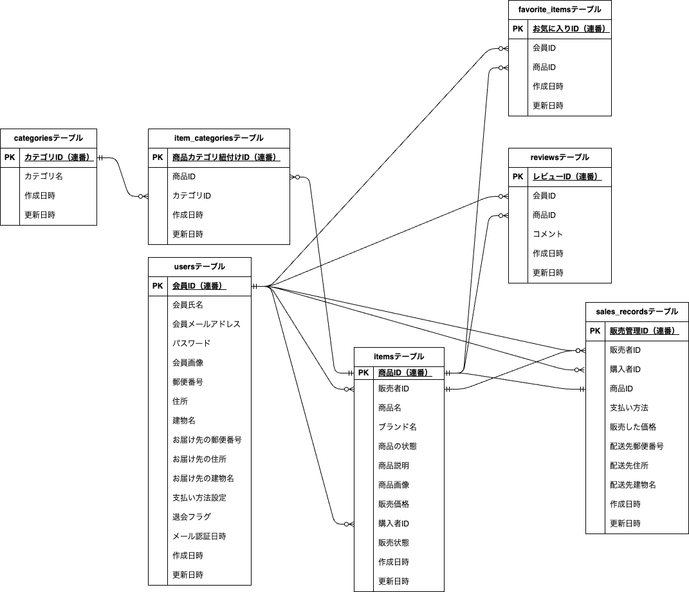

# flea-market-app

## 環境構築

### ◽️ Dockerビルド

- https://github.com/yuichiro-yamada/flea-market-app.git
- docker compose up -d --build

### ◽️ Laravel環境構築

- docker compose exec php bash
- composer install
- cp .env.example .env , 環境変数を適宜変更
- php artisan key:generate
- php artisan migrate:fresh --seed

### ◽️ メール認証の設定 (Mailtrap)

本アプリのアカウント登録時のメール認証には Mailtrap（テスト用メールサーバー）を使用しています。以下の手順で設定を行ってください。

- Mailtrap でアカウントを作成（またはログイン）します。
- Sandboxesからデモ用のSandboxを開き、Code Samplesで「PHP:Laravel 9+」を選択します。
- 画面に表示された以下のようなコードをコピーし .env ファイルに設定してください。

    ```env
    MAIL_MAILER=smtp
    MAIL_HOST=sandbox.smtp.mailtrap.io
    MAIL_PORT=2525
    MAIL_USERNAME=（あなたのユーザー名）
    MAIL_PASSWORD=（あなたのパスワード）
    ```

### ◽️ 決済機能の設定 (Stripe)

商品購入時の決済機能には Stripe のテスト環境を使用しています。以下の手順で設定を行ってください。

#### 1.APIキーの取得と設定

- Stripe の開発者アカウントを作成し、ダッシュボードを開きます。
- 開発者メニューの「APIキー」から、「公開可能キー」と「シークレットキー」を取得します。
  - 公開可能キー（pk_test_ から始まる値）
  - シークレットキー（sk_test_ から始まる値）
- コピーしたものを .env ファイルに下記のように設定してください。

    ```env
    STRIPE_KEY=pk_test_xxxxxxxxxxxxxxxxxxxxxxxxxxxxx
    STRIPE_SECRET=sk_test_5xxxxxxxxxxxxxxxxxxxxxxxxxxxxx
    ```

#### 2.ローカル環境でのWebhook動作確認手順

本アプリは「決済完了（checkout.session.completed）」などのイベントをStripeから受け取って処理を行います。ローカル環境でこの通知をテストするには、Stripe CLI を使用します。

- Stripe CLI 公式ドキュメント を参考に、お使いのパソコン（Mac/Windowsなど）に Stripe CLI をインストールします。
- ローカル環境のターミナル（Dockerコンテナの外）で、以下のコマンドを実行し、ブラウザを開いてStripeアカウントと連携（ログイン）させます。

    ```bash
    stripe login
    ```

- ログイン完了後、新しいターミナルタブ（またはウィンドウ）を開き、以下のコマンドを実行してStripeからの通知をローカルのLaravelに転送します。

    ```bash
    stripe listen --forward-to localhost/stripe/webhook
    ```

- 上記コマンド（stripe listen）を実行すると、ターミナル上に以下のような文字列が表示されます。この whsec_ から始まる文字列をコピーします。

    ```
    Your webhook signing secret is whsec_xxxxxxxxxxxxxxxxxxxxxxxxxxxxx
    ```

- コピーしたものを.env ファイルに下記のように設定してください。

    ```env
    STRIPE_WEBHOOK_SECRET=whsec_xxxxxxxxxxxxxxxxxxxxxxxxxxxxx
    ```

#### 3.テスト環境での動作確認方法

決済のテストを行う際は、商品購入画面で「購入する」ボタン押下後、Stripeが用意する決済画面へ遷移した際に下記情報を入力する必要があります。

- クレジットカード決済（「支払う」ボタン押下 → 即時決済完了）
    - **カード番号: 4242 4242 4242 4242（「42」を繰り返す番号）**
    - 有効期限: 将来の有効な月と年（例: 12 / 29 など）
    - CVC（セキュリティコード）: 任意の3桁（例: 123）
    - カード名義人: 任意の英語（例: TARO YAMADA）
- コンビニ決済（「支払う」ボタン押下 → 3分後に入金完了）
    - **メールアドレス： hanako@test.com**
    - 名前: 任意の名前（例: 山田 太郎）
    - 電話番号（省略可）: 任意の数字10〜11桁

### ◽️ storage内の画像データを表示できるようにする

storageフォルダ内の画像をブラウザで表示できるようにするために、以下のコマンドを実行してください。  
（storageフォルダ内への画像の配置はseedファイルで行っています。）

  ```bash
  php artisan storage:link
  ```

## テストの実行方法 (PHPUnit)

本アプリでは PHPUnit を使用して自動テストを実施しています。上記までの環境構築が完了した後、以下のコマンドでテストを実行することができます。
```bash
# 全てのテストを実行
docker compose exec php ./vendor/bin/phpunit

# 特定のテストファイルのみ実行
docker compose exec php ./vendor/bin/phpunit tests/Feature/（テストファイル名）
```
### テストファイル一覧

| テストファイル名 | テストする機能 |
| :--- | :--- |
| **RegisterTest.php** | 会員登録機能、メール認証機能 |
| **AuthenticationTest.php** | ログイン機能、ログアウト機能 |
| **ItemControllerTest.php** | 商品一覧取得、商品検索機能、商品詳細情報取得 |
| **MylistTest.php** | マイリスト一覧取得 |
| **FavoriteTest.php** | いいね機能 |
| **ReviewTest.php** | コメント送信機能 |
| **PurchaseTest.php** | 商品購入機能、支払い方法選択機能、配送先変更機能 |
| **ProfileTest.php** | ユーザー情報取得、ユーザー情報変更 |
| **SellTest.php** | 出品商品情報登録 |

テスト内容の詳細は下記URLを参照ください。
https://docs.google.com/spreadsheets/d/1sNCcqk0wZqkKJY46_Gw0vSJYtfcP2qciDxxgAk3NmpA/edit?gid=974925985#gid=974925985

## 開発環境

- お問い合わせ画面：http://localhost/
- ユーザー登録: http://localhost/register
- phpMyAdmin：http://localhost:8080/

## 使用技術(実行環境)

- PHP 8.1.34
- Laravel 10.50.2
- JavaScript (Vanilla JS)
- MySQL 8.0.26
- nginx 1.21.1

## 外部サービス
- **Stripe**（決済代行システム / クレジットカード・コンビニ決済機能）
- **Mailtrap**（テスト用SMTPサーバー / 新規会員登録時のメール認証機能）

## ER図


